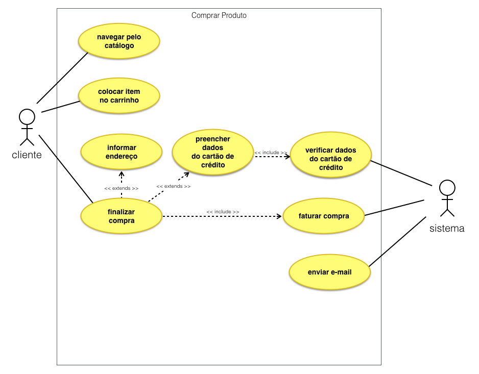

# DOCUMENTAÇÃO DO PROJETO

# SAUDE++

## INTRODUÇÃO

O Saude++ é um aplicativo mobile desenvolvido com Flutter que permite aos usuários monitorar diversos aspectos de sua saúde, como peso, IMC e medidas corporais . Através de uma interface intuitiva, o app oferece gráficos detalhados de progresso, ajudando os usuários a acompanhar suas metas e manter hábitos saudáveis ao longo do tempo.

[Saiba Mais](saudeapp/docs/introducao.md)

## ARQUITETURA

Para a criação do Saude++ foi utilizado a arquitetura MVC:

- **Model** : Pasta na qual fica os arquivos de armazenamento de dados do (Usuário, IMC e Medidas Corporais).
- **View** : Pasta na qual fica a interface da aplicação. Telas de Cadastro de usuário, Tela de Login, Tela de Regitro de IMC, Tela de Registro de Medidas Corporais, Tela Home.
- **Control**: Pasta que realiza o processo de intermediação entre **Model** e **View**, sendo responsável pelo gerenciamento dos dados entre telas e banco de dados.

[Saiba Mais](saudeapp/docs/arquitetura.md)

## FUNCIONALIDADES

O aplicativo de controle de peso, IMC e medidas corporais oferece as seguintes funcionalidades principais:

<!-- Codigo para por imagens dentro da documentação -->

[Saiba Mais](saudeapp/docs/funcionalidades.md)

